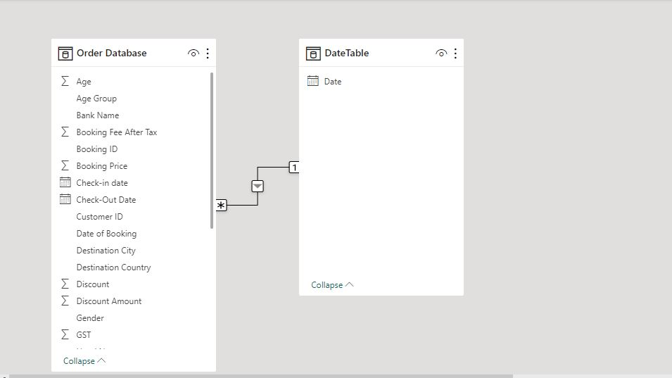
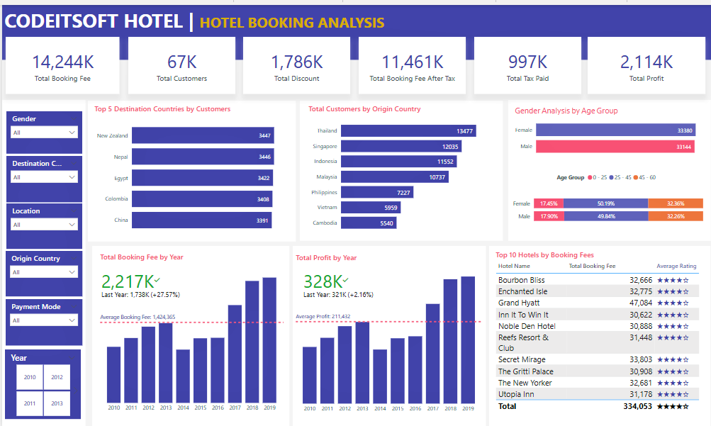

# Hotel-Bookings-Analysis

## Introduction

This is a PowerBI project on hotel bookings analysis for an imaginary hotel called **CodeitSoft Hotel**. The project is to analyze and derive insights from the hotel's booking data from the last nine years.

**_Disclaimer_**: _All datasets and reports do not represent any company, institution, or country, but just a dummy dataset to demonstrate the capabilities of Power BI._ 

## Problem Statement
The analysis was performed to determine the following:

1. Top 5 destination countries by customers.
2. Top 10 hotels by booking fees.
3. Total customers by origin country.
4. Gender analysis by age group.
5. Total booking fee by year.
6. Total profit by year.
7. Year-over-year growth in booking fees.
8. Year-over-year growth in profit.
9. Average booking fee.
10. Average profit.

## Power BI Concepts applied 

- DAX Concepts: Time intelligence functions, Calculated columns, custom columns, and Date Table using the Calendar() function.
- Data Modelling: Star Schema (*:1)

## Modelling
In order to efficiently analyze the data over time, an external "Date" table was created. The "Order Database" table is the fact table of the model. The "Date" table is connected to the "Order Database" table via a related column called "Date of Booking".

## Date Table Creation
The Date table was created using the **Calendar()** function. The function allows to manually specify the start date and end date. The "Date of Booking" column was carefully examined to determine the start and end date and was manually inputted below. This allows to set the "Date" table records the same as the "Date of Booking" date records.

**DateTable = CALENDAR("1/1/2010","31/12/2019")**

## Visualization

The report comprises a single page.

You can interact with the report [here](https://app.powerbi.com/view?r=eyJrIjoiMzg3NGU1MjItNmUwOS00ZmU3LWEwMjMtYTIzNTRhYWE2OTNhIiwidCI6IjNmYzY2NTU5LTE2MDYtNGM2MC1hYjNlLTkyMmM2MGNjYWIyNiJ9)

### Statistical Analysis                           
 

## Conclusion
- The most-rated hotel in the last nine years is Bourbon Bliss
- 2019 yielded the most profit as compared to the other years.
- 2019 yielded the highest booking fee.
- The customer base is dominated by Females on a slim margin.
- Thailand is the most dominant country of origin by customers.
- New Zealand is the most visited country by customers.

## Data Source
The data was sourced from [FestMan Learning Hub](https://festman.io/).

  

